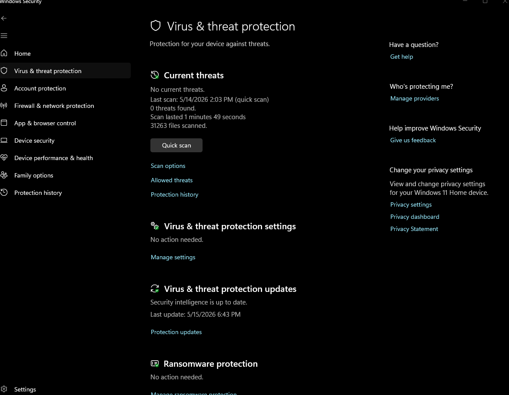
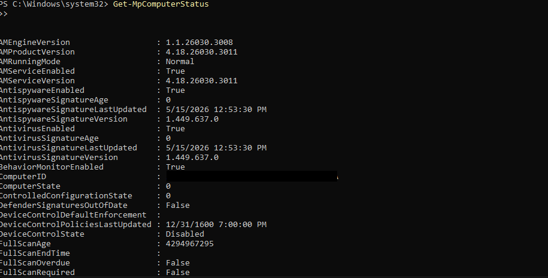
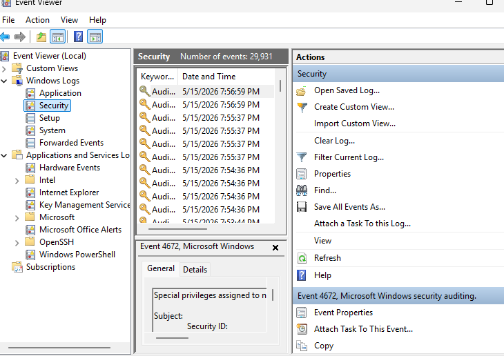
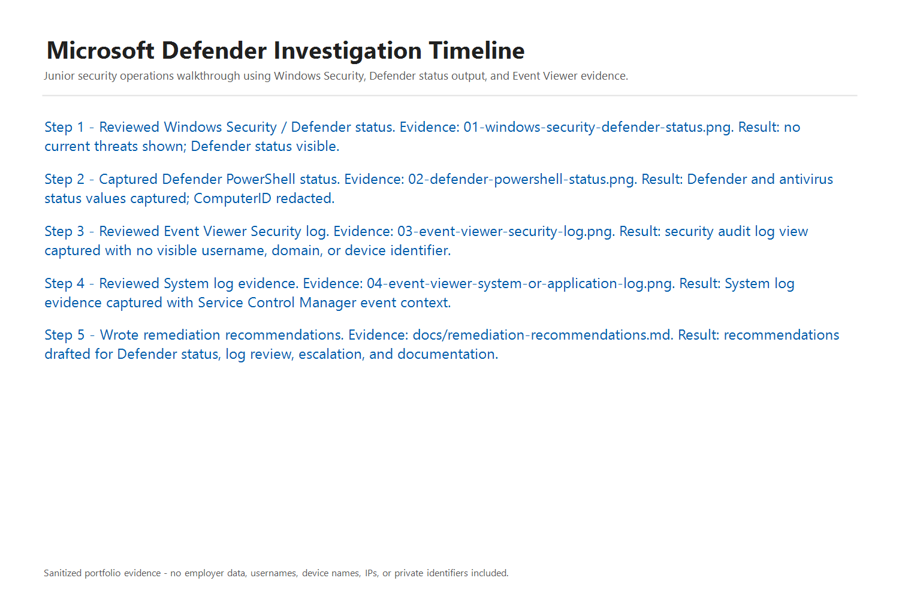

<!-- recruiter-review:start -->
## Recruiter Quick Review

**Best-fit roles:** IT Support Specialist, Desktop Support, Endpoint Support, Security Support, Junior SOC Analyst, Microsoft security support, incident documentation support.

**What this proves:** I can validate endpoint security posture, collect Windows/Defender evidence, review Event Viewer signals, write an investigation timeline, and document remediation recommendations from an IT support foundation.

**Search keywords:** Microsoft Defender, Windows Security, endpoint security, Event Viewer, PowerShell, incident response, endpoint investigation, Windows 10/11, remediation, SOC, security support, documentation, IT support.

**Start here:** [RECRUITER_REVIEW.md](RECRUITER_REVIEW.md)

**Honest scope:** Portfolio endpoint investigation walkthrough using built-in Windows and Defender evidence. This does not claim advanced EDR administration, malware reverse engineering, or senior threat hunting.
<!-- recruiter-review:end -->

# Microsoft Defender Endpoint Investigation Walkthrough

## Purpose

This project documents a realistic endpoint investigation workflow using built-in Windows security evidence, Microsoft Defender status checks, Event Viewer review, and clear remediation notes.

The goal is to show how IT support troubleshooting translates into junior security operations work without overstating experience or claiming advanced EDR administration.

## Scope

- Windows Security / Microsoft Defender status review
- PowerShell Defender status output
- Event Viewer evidence review
- Basic endpoint investigation timeline
- Containment and remediation recommendations
- Lessons learned

## Tools Used

- Windows Security
- Microsoft Defender Antivirus
- PowerShell
- Event Viewer
- Markdown documentation
- Sanitized screenshots

## Skills Demonstrated

- Endpoint security awareness
- Defender status validation
- Windows event review
- Evidence collection
- Incident note writing
- Containment recommendation writing
- IT support to security operations transfer

## Evidence Included

| Evidence | Target File |
|---|---|
| Windows Security / Defender status screenshot | `screenshots/01-windows-security-defender-status.png` |
| PowerShell `Get-MpComputerStatus` output | `screenshots/02-defender-powershell-status.png` |
| Event Viewer Security log screenshot | `screenshots/03-event-viewer-security-log.png` |
| Event Viewer System or Application log screenshot | `screenshots/04-event-viewer-system-or-application-log.png` |
| Investigation timeline screenshot or markdown evidence | `screenshots/05-investigation-timeline.png` |
| Remediation recommendations screenshot or markdown evidence | `screenshots/06-remediation-recommendations.png` |

## Screenshot Preview

## Documentation

- `evidence/defender-status.md`
- `evidence/powershell-output.md`
- `evidence/event-viewer-review.md`
- `docs/investigation-timeline.md`
- `docs/remediation-recommendations.md`
- `docs/lessons-learned.md`

## Scope Boundaries

- Do not claim Microsoft Defender for Endpoint administration unless Defender for Endpoint was actually used.
- Do not download malware.
- Do not run attack tools.
- Do not claim advanced EDR, malware reverse engineering, threat hunting, or detection engineering.

## Interview Talking Point

This project shows how I validate endpoint security posture, collect Windows evidence, review logs, document findings, and recommend containment or remediation steps using tools common in IT support and security operations.
